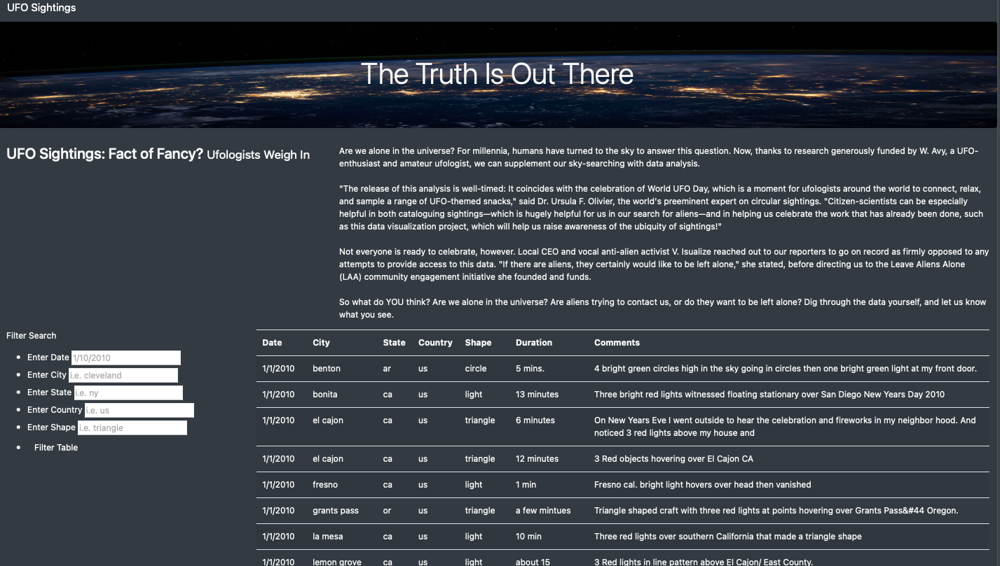
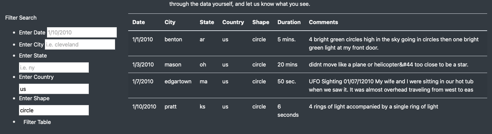

# UFO

## Overview of Project: Explain the purpose of this analysis.

UFO sightings are exciting! The information is interesting and sought after. In this project we created an interactive website that puts UFO  information into a dynamic table. This website allowes users to filter based on mutliple criteria. 

## Results:

The search critetia allows users to quickly anaylze data by filtering based on date, city, state, country, and ufo shape. Someone interested in learning about UFO sightings in the US that were circular in shape, would simply add this critera to the filters. The table then displays information based on the users criteria. This reduces the time information seekers need to sift through sighting data. 

## Summary: 

The website is user friendly and is super functional. The website would be even more helpful if it allowed users to save a search or use multiple criteria within filters. For example, filtering for multiple cities within one search. 
